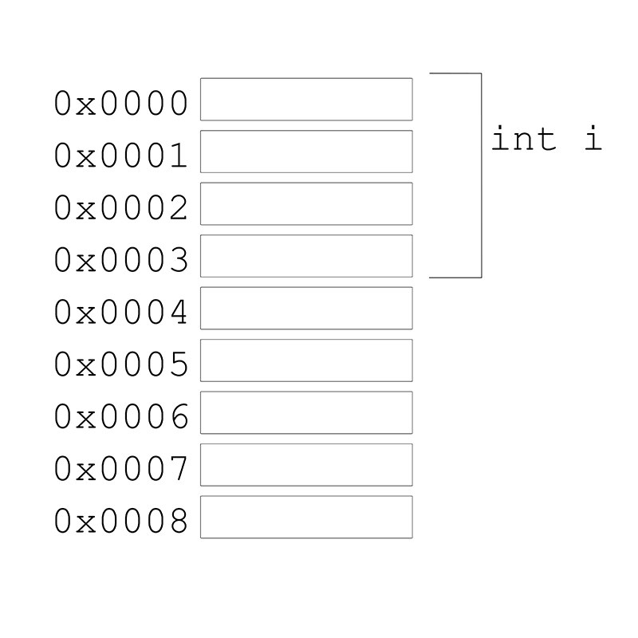
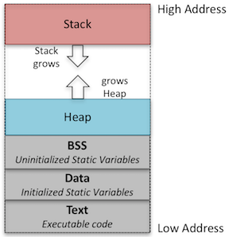
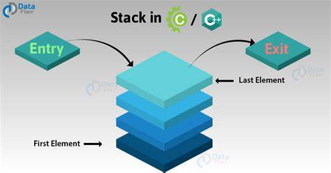
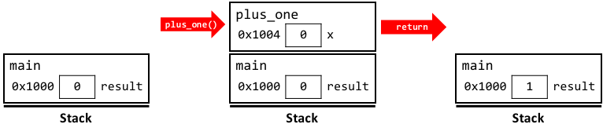
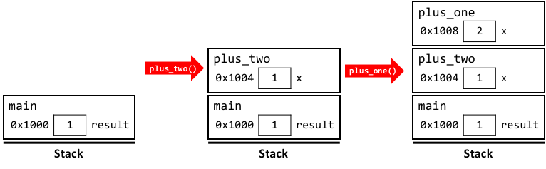
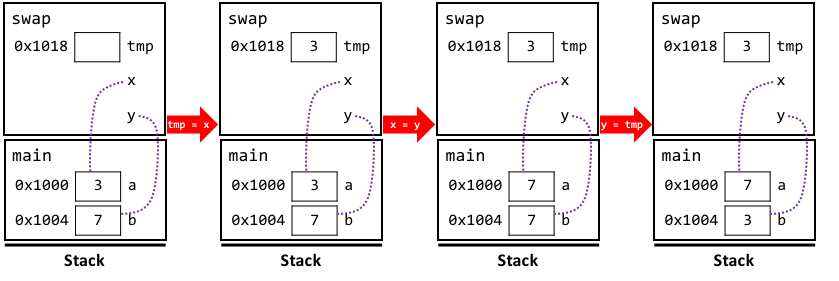
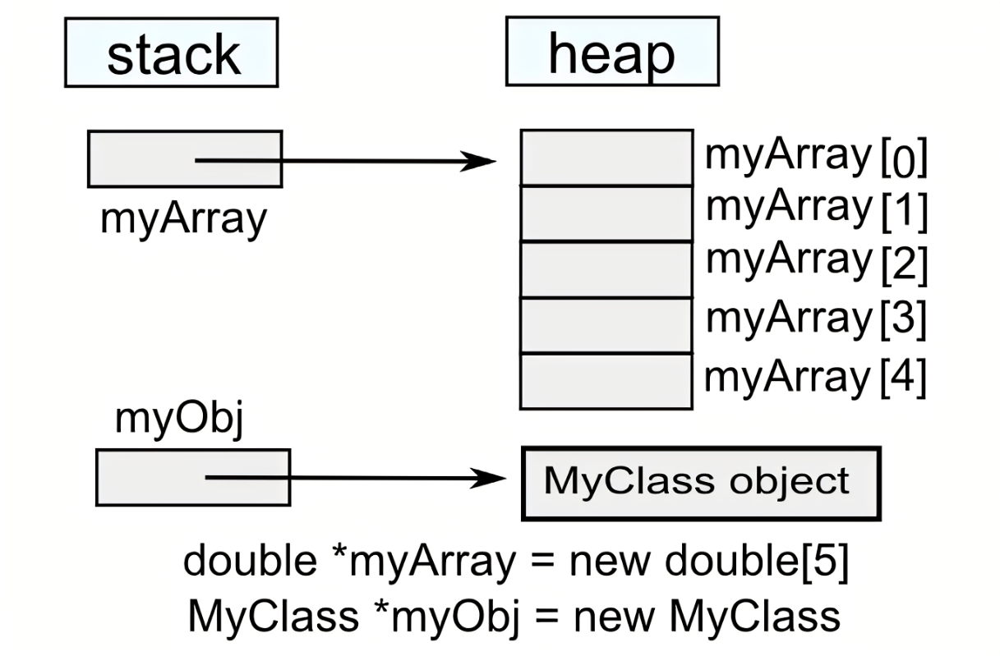
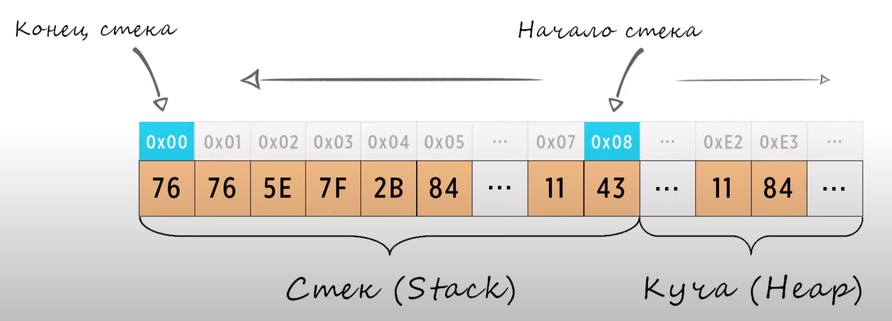
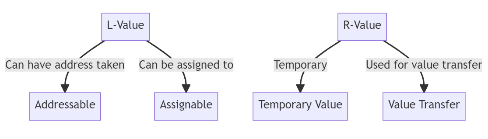

# Работа с памятью, стек 

**Память:**  
* Память программы представляет собой **последовательность байтов**, каждый из которых имеет **уникальный адрес**.
* Все данные, включая переменные, объекты, инструкции программы и т. д., хранятся в памяти в виде последовательности байтов.

**Байт** - это наименьшая адресуемая единица памяти в компьютере.  
* Он состоит из последовательности битов, обычно 8 бит.
* Байт обычно используется для хранения данных и представления символов.
* В C++ байт может хранить значения любого элемента базового набора символов и любого элемента базового набора символов литералов.
* Стандарт C++ гарантирует, что размер байта составляет не менее 8 бит.




## Память, выделяемая под программу

1. Сегмент кода (текстовый сегмент):  
Содержит скомпилированные инструкции программы.  
Обычно представляет собой только для чтения и содержит исполняемый код.  
Инструкции из этого сегмента извлекаются процессором для выполнения.  

2. Сегмент BSS (сегмент неинициализированных данных):  
Хранит глобальные и статические переменные, инициализированные нулями.
Эти переменные по умолчанию инициализируются нулями.

3. Сегмент данных (сегмент инициализированных данных):  
Хранит инициализированные глобальные и статические переменные.
Инициализированные переменные имеют определенные значения, присвоенные на этапе компиляции.

4. Куча:  
Область памяти, используемая для динамического выделения памяти.
Переменные, выделяемые в куче, определяются только во время выполнения программы и могут быть изменены в размере по мере необходимости.
Управление памятью на куче обычно осуществляется функциями, такими как malloc() и free() в C, или операторами new и delete в C++.

5. Стек вызовов:  
Хранит информацию о вызовах функций, включая параметры, локальные переменные, адреса возврата и другие данные, связанные с функциями.
При каждом вызове функции создается новый фрейм стека, который добавляется в вершину стека.
При возврате из функции ее фрейм удаляется из стека.
Стек вызовов необходим для управления вызовами функций и поддержания потока выполнения программы.



# Стек как структура данных

Структура данных - это способ организации данных в программировании для их эффективного использования. Работает по принципу LIFO (Last-In-First-Out) Элемент, добавленный в стек последним - первым покинет стек.

В отличие от массива, который позволяет вам доступ и изменение элементов в любом порядке (это называется случайным доступом), стек более ограничен. Операции, которые можно выполнить со стеком, соответствуют трем вышеперечисленным действиям:

1. Посмотреть верхний элемент в стеке (обычно с помощью функции top(), но иногда это называется peek()).
2. Взять верхний элемент из стека (сделать это можно с помощью функции pop()).
3. Положить новый элемент сверху стека (это делается с помощью функции push()).



# Стек и куча

Стек - выделяется небольшой и может случится перепеолнение stack overflow
Куча - пространство для динамического выделения памяти

## Визуализация стека вызовов

```cpp
int plus_one(int x) {
  return x + 1;
}

int plus_two(int x) {
  return plus_one(x + 1);
}

int main() {
  int result = 0;
  result = plus_one(0);
  result = plus_two(result);
  cout << result;             // prints 3
}
```



С передачей по ссылке

```cpp
void swap(int &x, int &y) {
  int tmp = x;
  x = y;
  y = tmp;
}

int main() {
  int a = 3;
  int b = 7;
  cout << a << ", " << b << endl;  // prints 3, 7
  swap(a, b);
  cout << a << ", " << b << endl;  // prints 7, 3
}
```




| Свойства               | Стек                                      | Куча                                      |
|------------------------|-------------------------------------------|-------------------------------------------|
| Скорость выделения     | Быстрое                                   | Медленное                                 |
| Область видимости      | Ограничена блоком кода                    | Глобальная                                |
| Время жизни            | Ограничено временем жизни блока кода      | Остается выделенным до явного освобождения |
| Известность на этапе компиляции | Известна                               | Неизвестна                                |
| Метод доступа          | Прямой доступ через переменную            | Требуется доступ через указатель          |
| Размер                 | Ограничен, обычно небольшой              | Неограничен, можно выделять большие объемы памяти |
| Использование          | Для хранения локальных переменных и данных, связанных с вызовами функций | Для хранения динамически выделяемых данных и больших структур данных |
| Подверженность переполнению | Да (ограниченный размер)               | Нет (можно выделять память по мере необходимости) |





## new delete

new – для выделения памяти под указанный тип данных с автоматическим вызовом конструктора;  
delete – освобождение памяти с автоматическим вызовом деструктора.    

new [] – для выделения памяти под указанное число объектов;   
delete [] – для освобождения памяти массива объектов.  

Когда динамически выделенная переменная удаляется с помощью оператора delete, память "возвращается" в кучу и может быть повторно выделена для будущих запросов выделения. Помните, что удаление указателя не удаляет переменную, а только возвращает память по соответствующему адресу обратно в операционную систему.

```cpp
// Выделение памяти под один объект типа int
int* p = new int; // p указывает на выделенную область памяти
*p = 42; // запись значения в выделенную область
cout << *p << endl; // чтение значения из выделенной области
delete p; // освобождение памяти
p = nullptr; // обнуление указателя

// Выделение памяти под массив из 10 объектов типа double
double* arr = new double[10]; // arr указывает на начало массива
for (int i = 0; i < 10; i++) {
    arr[i] = i * 0.1; // запись значений в элементы массива
}
for (int i = 0; i < 10; i++) {
    cout << arr[i] << " "; // чтение значений из элементов массива
}
cout << endl;
delete[] arr; // освобождение памяти, выделенной под массив
arr = nullptr; // обнуление указателя
```

# Проблемы управления динамической памятью

1. Утечки памяти - это ситуация, когда выделенная область памяти не освобождается после того, как перестает быть нужной программе. Это может привести к неэффективному использованию ресурсов системы, замедлению работы программы или ее аварийному завершению из-за нехватки доступной памяти. Утечки памяти могут возникнуть, например, если:

* Программист забывает вызвать оператор delete для выделенной области памяти.
* Программист теряет доступ к выделенной области памяти, например, перезаписывая или не сохраняя указатель на нее.
* Программист не учитывает исключительные ситуации, когда оператор delete может не быть вызван из-за прерывания выполнения функции.

2. Использование объекта после удаления

3. Повторное освобождение одной и той же памяти

# Альтернативы использованию new и delete

1. Использование умных указателей - это специальные классы, которые оборачивают обычные указатели и автоматически освобождают память при уничтожении объекта умного указателя. Умные указатели также предоставляют различные механизмы для управления временем жизни объектов в динамической памяти, такие как подсчет ссылок или семантика перемещения. В стандартной библиотеке C++ есть несколько видов умных указателей, таких как std::unique_ptr, std::shared_ptr, std::weak_ptr и т.д., которые отличаются своими свойствами и назначением.

2. Использование контейнеров - это классы, которые представляют собой структуры данных, хранящие наборы элементов одного или разных типов. Контейнеры также автоматически выделяют и освобождают память под свои элементы, а также предоставляют различные методы для работы с ними. В стандартной библиотеке C++ есть много видов контейнеров, таких как std::vector, std::list, std::map, std::string и т.д., которые отличаются своей реализацией и характеристиками.

# Конструктор перемещения и функция std::move()

Копирование может осуществляться при многих обстоятельствах. При некоторых из них объект разрушается немедленно после копирования. В этих случаях перемещение объекта вместо копирования способно обеспечить существенное увеличение производительности.

Выражения в c++ могут быть r-value или l-value. Первоначально имели простую мнемоническую цель: l-значения могли стоять слева от оператора присвоения, а r-значения не могли. 



**l-value** обозначает объект, занимаемый адресуемое место в памяти. Обычно это переменные или ссылки, к которым мы можем что-то присвоить.

```cpp
int x = 10;  // 'x' l-value
x = 20;      // 'x' с левой стороны присваивания
```
**r-value** это временное значение, без специально определенного места в памяти. Обычно используется для инициализации r-value. 

```cpp
int y = x + 5;  // 'x + 5' r-value
```

### Ссылки на r-value
Ссылка на r-значение (r-value reference) — это ссылка, которая должна быть связана с r-value. Ссылку на r-value получают с использованием символа &&, а не &. 

```cpp
    int i = 42;
    int &r = i; // ok: r ссылается на i
    int &&rr = i; // ошибка: нельзя связать ссылку на r-значение
    // с l-значением
    int &r2 = i * 42; // ошибка: i * 42 - это rзначение
    const int &r3 = i * 42; // ok: ссылку на константу можно
    // связать с r-значением
    int &&rr2 = i * 42; // ok: связать rr2 срезультатом умножения
```
**l-значения — устойчивы; r-значения — эфемерны**

```cpp
// Конструктор перемещения
MyClass(MyClass&& other) noexcept : data(other.data) {
    other.data = nullptr; 
}
```


