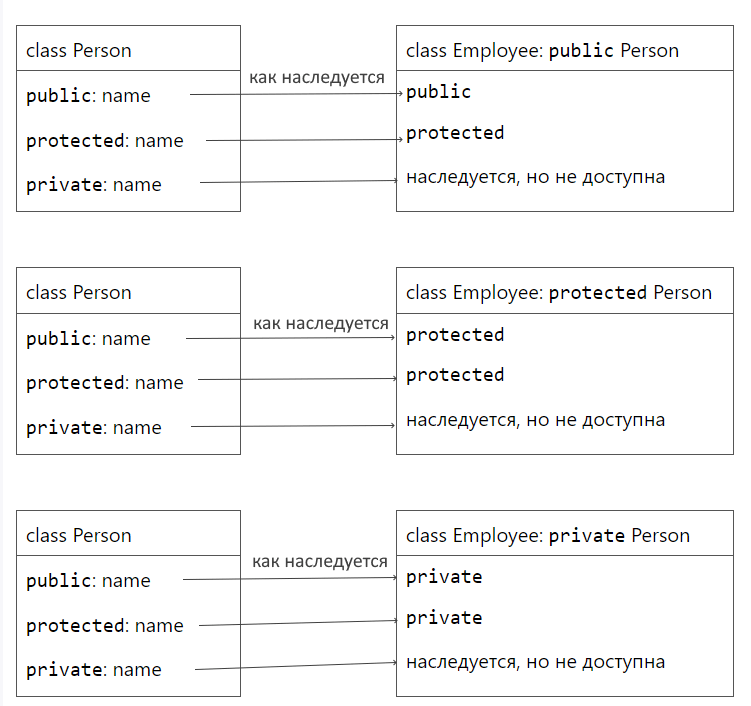
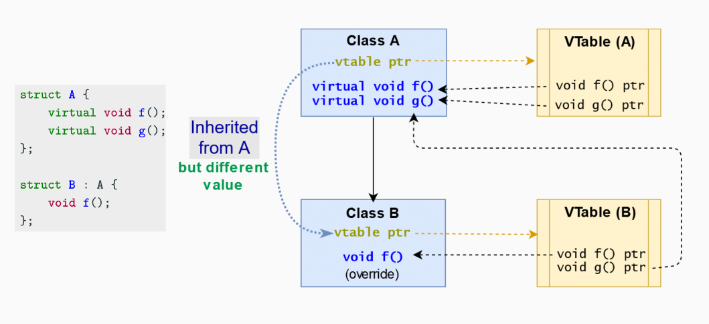

# Наследование - один из принципов ООП

**Наследование** - это концепция, в рамках которой объект может наследовать какие-либо свойства/методы другого объекта при этом дополняя/расширяя свой функционал.

Класс, от которого наследуемся, - базовый или родительский класс (base/parent), а класс который наследует - производный или дочерний (derived/child)

*Производные классы расширяют существующие* - то есть добавляет новый функционал, но **не урезают функционал родительского класса**

```cpp
class ChildClass : [<modifiers>] BaseClass {};
```

Простой пример открытого наследования (public)

```cpp
// Базовый класс
class BaseClass {
public:
    void baseFunction() {
        std::cout << "BaseFunc\n";
    }
};

// Производный класс
class DerivedClass : public BaseClass {
public:
    void derivedFunction() {
        std::cout << "ChildFunc\n";
    }
};

int main() {
    DerivedClass derivedObj;

    derivedObj.baseFunction();
    derivedObj.derivedFunction();
}
```

### Модификаторы доступа в наследовании: 



### Обратите внимание, что приватные члены наследуются и присутствуют в дочернем классе

```cpp
// Базовый класс
class BaseClass {
private:
    int privateInt;

public:
    BaseClass() : privateInt(0) {}

    void setPrivateInt(int value) {
        privateInt = value;
    }
    int getPrivateInt() {
        return privateInt;
    }
};

// Производный класс
class DerivedClass : public BaseClass {
public:
    void modifyPrivateInt() {
        // напрямую не изменить значение приватного поля
        setPrivateInt(42);
    }
};

int main() {
    DerivedClass derivedObj;
    
    std::cout << "Before: " << derivedObj.getPrivateInt() << std::endl;
    // std::cout << derivedObj.privateInt; // Ошибка компиляции

    derivedObj.modifyPrivateInt();

    std::cout << "After: " << derivedObj.getPrivateInt() << std::endl;

    return 0;
}
```  
---

### При создании объекта производного класса вызывается сначала конструктор родительского, а при уничтожении деструктор родительского вызывается последним

```cpp
class BaseClass {
public:
    BaseClass() {
        std::cout << "BaseClass constructor\n";
    }

    ~BaseClass() {
        std::cout << "BaseClass destructor\n";
    }
};


class DerivedClass : public BaseClass {
public:
    DerivedClass() {
        std::cout << "DerivedClass constructor\n";
    }

    ~DerivedClass() {
        std::cout << "DerivedClass destructor\n";
    }
};

int main() {
    {
        DerivedClass derivedObj;
    }
}
```

## Публичное (открытое) наследование

* Отношения между классами, где A родительский, B - производный: **B is A**
* Указатель на объект родительского класса может указывать и на объект производного, например, можно создать массив из указателей на родительский класс, а хранить в нем все/любые объекты производных классов
* Указатель на родительский класс можно явно преобразовать к указателю на дочерний с помощью static_cast


```cpp
class Base {
public:
    int b = 0;
};

class Derived : public Base {
public:
    int d = 10;
};

class DerivedSecond : public Base {
public:
    int d2 = 20;
};

int main() {
    Derived* derivedPtr = new Derived;
    Base* basePtr = derivedPtr;
    derivedPtr = static_cast<Derived*>(basePtr);
    std::cout << derivedPtr->d << std::endl;

    //не корректно кастуем не к тому дочернему классу
    DerivedSecond* derivedPtrSecond = static_cast<DerivedSecond*>(basePtr);
    std::cout << derivedPtrSecond->d2 << std::endl;
}
```

## Инициализация полей родительского класса из конструктора дочернего класса в списке инициализации
```cpp
class BaseClass {
public:
    int baseValue;

    BaseClass(int value) : baseValue(value) {
        std::cout << "BaseClass constructor initialized with bvalue " << baseValue << std::endl;
    }
};


class DerivedClass : public BaseClass {
public:
    DerivedClass(int bvalue, int dvalue) 
    : BaseClass(bvalue),  derivedValue(dvalue) {
        std::cout << "DerivedClass constructor initialized with bvalue " << baseValue << std::endl;
        std::cout << "DerivedClass constructor initialized with dvalue " << derivedValue << std::endl;
    }

private:
    int derivedValue;
};

int main() {
    DerivedClass derivedObj(42, 25);
}
```

## Circle–ellipse problem (square–rectangle problem)

Вечный пример наследования)) 

Что нужно наследовать? Квадрат от прямоугольника или прямоугольник от квадрата?

Обратите внимание, что при открытом наследовании должно соблюдаться два пункта:
* DerivedClass расширяет(extends) BaseClass
* DerivedClass является частным случаем BaseClass


## Полиморфизм

Полиморфизм - способность объекта изменять свое поведение в соответствии с контекстом
* overloading - статический полиморфизм (на этапе компиляции - compile-time binding). Методы с одним именем и параметрами разного типа (типы известны), шаблонные функции (типы тоже известны)
```cpp
void foo(int a);
void foo(double a);
```
 
* overriding - динамический полиморфизм (во время выполнения программы - run-time binding). В процессе исполнения определяется тип и потом сопоставляется с нужным методом. Пример **virtual function**

## Проблема полиморфизма без virtual 

```cpp
class Base {
public:
    int b = 0;
    void foo() {
        std::cout << b << std::endl;
    }
};

class Derived : public Base {
public:
    int d = 10;
    void foo() {
        std::cout << d << std::endl;
    }
};

void bar(Base& baseObg) {
    baseObg.foo();
}

int main() {
    Derived derived;
    Base base;

    bar(base);
    bar(derived);
}
```

## От простого наследования до override и чистто виртуальных методов

1. В код выше добавим ключевое слово virtual в метод родительского класса - укажем что этот метод может быть перегружен в дочернем классе

```cpp
class Base {
public:
    int b = 0;
    virtual void foo() {
        std::cout << b << std::endl;
    }
};

class Derived : public Base {
public:
    int d = 10;
    void foo() {
        std::cout << d << std::endl;
    }
};

void bar(Base& baseObg) {
    baseObg.foo();
}

int main() {
    Derived derived;
    Base base;

    bar(base);
    bar(derived);
}
```

### Может возникнуть проблема с overloading

Какой результат?

```cpp
class Base {
public:
    int b = 0;
    virtual void foo(int a) {
        std::cout << b << std::endl;
        std::cout << "Base" << std::endl;
    }
};

class Derived : public Base {
public:
    int d = 10;
    void foo(long a) {
        std::cout << d << std::endl;
        std::cout << "Derived" << std::endl;
    }
};


int main() {
    Base* ptr = new Derived;

    ptr->foo(20);
}
```

2. Проблему решаем добавление override к перегуруженному методу дочернего класса

## Виртуальная таблица - look-up table

Создается при наличии в классе хотя бы одного виртуального метода. Конструктор производного класса инициализирует таблицу своими методами




3. Сделаем родительский класс интерфейсным - без реализации виртуальных методов, сделав их чисто-виртуальными

Абстрактный базовый класс имет как минимум один чисто вирутальный метод, интерфейс - все

```cpp
class IBase {
public:
    int b = 0;
    virtual void foo(int a) = 0;
};
```

4. Добавим виртуальный деструктор, чтобы освободить память дочернего класса тоже. (Если есть хоть один вирутуальный метод - нужен вирутальный деструктор)
Виртульный деструктор нужен для корректного уничтожения объекта производного класса по указателю на родительский класс

```cpp
class IBase {
public:
    virtual void foo() = 0;
    virtual ~IBase() {
        std::cout << "Base destructor\n";
    }
};


class Derived : public IBase {
public:
    ~Derived() {
        std::cout << "Derived destructor\n";
    }
    void foo(){
        std::cout << "Derived func\n";
    }
};

int main() {
    IBase *basePtr = new Derived; 
    delete basePtr; 
}
```

* Нельзя вызывать виртуальные методы в конструкторах и деструкторах - не понятно какой именно должен вызваться
* Нельзя в виртуальных методах использовать параметры по умолчанию - они не наследуются

# Домашнее задание

* Написать IStackBase - шаблонный абстрактный класс, от которого наследуются StackArrT и StackLstT
* В директории с проектами в папке IStack должно быть три заголовочных файла (один на абстрактный класс, два на релизацию) и CMakeLists
* В классе IStack методы должны быть чисто виртуальными
* Нужно добавить чисто виртуальный метод void printToStream(std::ostream& os) чтобы перегрузить оператор вывода в родительском классе
* Перегрузить оператор вывода в родительском классе
* Протестировать 