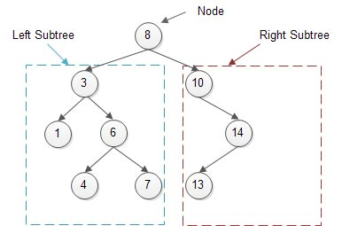
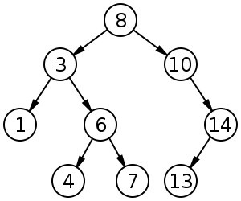

# Бинарное дерево поиска

Бинарное дерево - это иерархическая структура данных, в которой каждый узел имеет значение (в данном случае, это также ключ) и ссылки на левого и правого потомков. Узел, который находится на самом верхнем уровне (который не является потомком кого-либо еще), называется корнем. Узлы, у которых нет потомков, называются листьями.

Бинарное дерево поиска - это бинарное дерево с дополнительными свойствами: значение левого потомка меньше значения родителя, и значение правого потомка больше значения родителя для каждого узла дерева. То есть данные в бинарном дереве поиска хранятся отсортированными. Каждый раз, когда вы добавляете новый или удаляете существующий узел, сортированный порядок дерева сохраняется. При поиске элемента искомое значение сравнивается с корнем. Если желаемое значение больше корня, то поиск продолжается в правом потомке корня, если меньше, то в левом, если равно, то значение найдено, и поиск завершается.



## Слева значения меньше восьми, справа - больше



## Домашнее задание написать реализацию (без рекурсии и без while(true))

```cpp
struct TreeNode {
    int data;
    TreeNode* left;
    TreeNode* right;

    TreeNode(int val) : data(val), left(nullptr), right(nullptr) {}
};

class BinarySearchTree {
public:
    // Конструктор
    BinarySearchTree();

    // Деструктор
    ~BinarySearchTree();

    // Метод для получения корневого узла дерева
    TreeNode* root();

    // Метод для добавления узла в дерево
    void add(int data);

    // Метод для проверки наличия узла в дереве
    bool has(int data);

    // Метод для поиска узла в дереве
    TreeNode* find(int data);

    // Метод для удаления узла из дерева
    void remove(int data);
    //найти ноду
    // если лист - просто удалить
    // если у ноду есть один из потомков
    // если есть оба - минимальный узел в правом поддереве заменяет текущую

    // Метод для нахождения минимального значения в дереве
    int min();

    // Метод для нахождения максимального значения в дереве
    int max();

private:
    TreeNode* root;
};
```