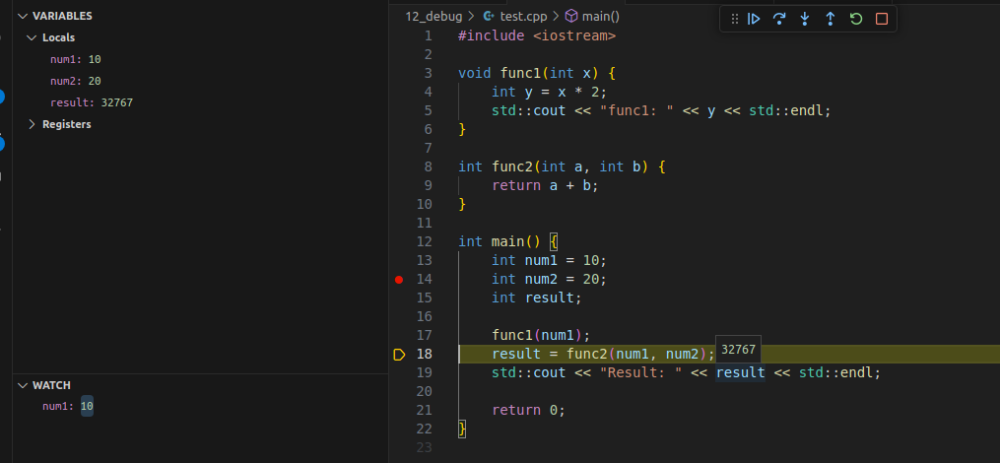

# Debug. Sanitize. Lint

## Debugging

Отладка - это процесс исследования и исправления ошибок в программном обеспечении. Она выполняется с целью обеспечения корректного выполнения программы и улучшения её качества.



GDB -  это системно независимый кросс‑платформенный отладчик. Популярный для программ на C и C++

Чтобы приступить к отладке с помощью GDB нужно скопмилировать программу с флагом  ```-g```

```
g++ -g -o main main.cpp
```

Некоторые команды
```bash
gdb <filename> # запуск отладчика
run # Запустить программу или продолжить ее выполнение после остановки.
break <line/function> # Установить точку останова на определенной линии кода или в функции.
next # Выполнить следующую строку кода, не заходя внутрь вызываемых функций.
step # Выполнить следующую строку кода, заходя внутрь вызываемых функций.
print <variable/expression> # Вывести значение переменной или выражения.
info breakpoints # Показать информацию о текущих точках останова.
backtrace # Вывести стек вызовов (трассировку вызовов) на текущий момент времени.
continue # Продолжить выполнение программы до следующей точки останова.
list # Показать участок исходного кода вокруг текущей точки останова.
quit # Выйти из отладчика GDB и завершить отладку.
```
https://manpages.ubuntu.com/manpages/jammy/man1/gdb.1.html

## Sanitizing

Санитайзеры (Sanitizers) - это инструменты для статического или динамического анализа программного обеспечения, которые помогают обнаруживать и предотвращать различные виды ошибок в коде, такие как переполнение буфера, утечки памяти, неопределенное поведение и другие. 

[Санитайзеры компилятора clang](https://skkv-itmo.gitbook.io/ct-c-cpp-course/code-analysis/sanitizer)

```bash
clang++ -fsanitize=memory -fno-omit-frame-pointer -g test2.cpp -o main -lstdc++
```

```bash
-fsanitize=memory # в этом параметре перечисляются санитайзеры
-fsanitize=address # AddressSanitizer – детектор ошибок при работе с адресацией (выход за границы выделенной области памяти, стека, двойное высвобождение памяти и другое)
-fsanitize=memory # MemorySanitizer – детектор чтения из неинициализированной области памяти
-fsanitize=undefined # UndefinedBehaviorSanitizer – детектор специфических ошибок, чаще всего регламентированных в стандарте как Undefined Behavior
-fsanitize=leak # LeakSanitizer – детектор утечки (не освобождаемой) памяти.
-fsanitize=thread # ThreadSanitizer – детектор ошибок при взаимодействиями между потоками (data race)
```

Утечки памяти - то, за чем очень важно следить  !!!
* [Microsoft: 70 percent of all security bugs are memory safety issues ](https://www.zdnet.com/article/microsoft-70-percent-of-all-security-bugs-are-memory-safety-issues/)
* [Chrome: 70% of all security bugs are memory safety issues ](https://www.zdnet.com/article/chrome-70-of-all-security-bugs-are-memory-safety-issues/)


Проблемы с памятью:

1. **Переполнение буфера (Buffer Overflow)**: Нарушение целостности данных, когда данные записываются за пределы выделенной области памяти, что может привести к перезаписи других данных или даже выполнению вредоносного кода.


```cpp
#include <iostream>
#include <cstring>

int main() {
    char buffer[5];
    strcpy(buffer, "Hello, World!"); // переполнение буфера
    std::cout << buffer << std::endl;
}
```

2. **Отказ страницы (Page Fault)**: Ошибка, возникающая при попытке доступа к физической памяти, которая не загружена в оперативную память, часто вызванная неправильным обращением к адресам памяти.

```cpp
#include <iostream>

int main() {
    int* ptr = nullptr;
    std::cout << *ptr << std::endl; // доступ к нулевому указателю
    return 0;
}
```


3.  **Использование после освобождения (Use-After-Free)**: Ситуация, когда программа обращается к памяти, которая уже была освобождена, что может привести к ошибкам или некорректному поведению.

```cpp
#include <iostream>

int main() {
    int* ptr = new int;
    delete ptr;
    *ptr = 10; // использование освобожденной памяти
    return 0;
}
```

4. **Двойное освобождение (Double Free)**: Ошибка, возникающая при повторном освобождении уже освобожденной памяти, что может привести к нарушению структуры управления памятью и аварийному завершению программы.

```cpp
#include <iostream>

int main() {
    int* ptr = new int;
    delete ptr;
    delete ptr; // повторное освобождение памяти
    return 0;
}
```
5. **Утечка памяти**

```cpp
#include <iostream>

int main() {
    int* ptr = new int; // Выделение памяти
    return 0; // Утечка памяти, так как не было освобождения выделенной памяти
}

```

6. **Гонка за данными (Race Condition)** - Несогласованность взаимодействия нескольких потоков, что приводит к непредсказуемому поведению программы и возможно к сбоям или утечкам данных.

```cpp
#include <iostream>
#include <thread>

int counter = 0;

void increment() {
    for (int i = 0; i < 1000000; ++i) {
        counter++;
    }
}

int main() {
    std::thread t1(increment);
    std::thread t2(increment);
    t1.join();
    t2.join();
    std::cout << "Counter: " << counter << std::endl;
    return 0;
}
```

## Linting

**Линтеры** - это инструменты статического анализа кода, которые проверяют исходный код на соответствие определенным стандартам кодирования, правилам форматирования и лучшим практикам программирования. Они помогают обнаруживать потенциальные проблемы, ошибки и уязвимости на ранних этапах разработки.


[Clang-tidy](https://clang.llvm.org/extra/clang-tidy/)
[Cpplint (Google Style Guide)](https://github.com/cpplint/cpplint)