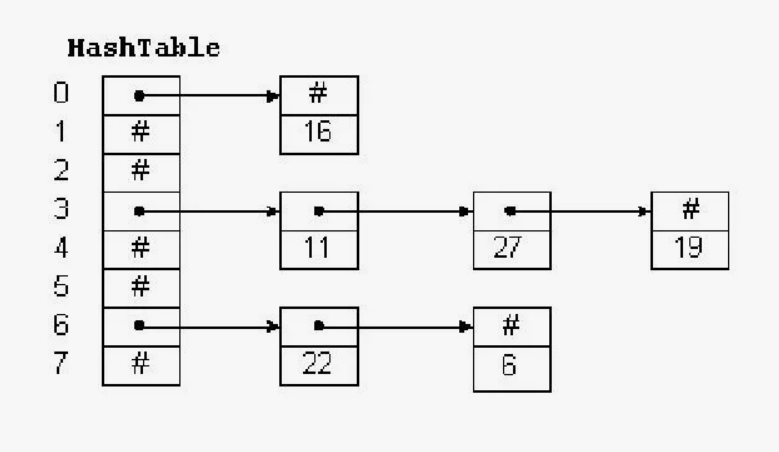
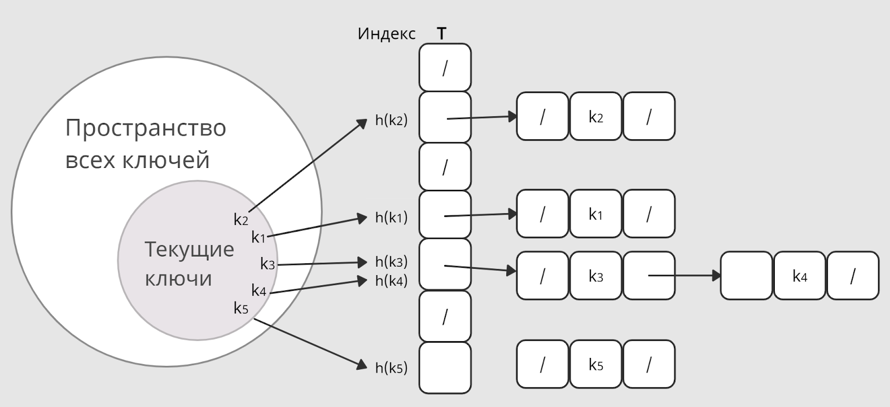
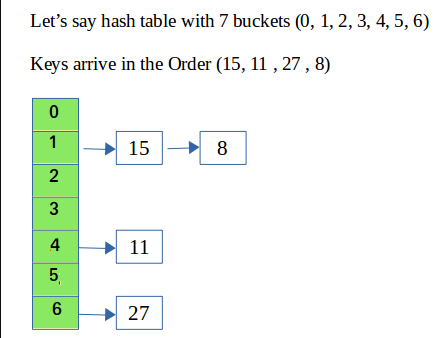

# Хэш-таблица: unordered_map

Хэш-таблица - тип данных, с помощью которого хранятся пары «ключ-значение». Однако индекс хранения значения определяется хэш-функцией

**Пусть k - ключ, тогда h(k) = ind хранения данных по ключу**

## Примеры хэш-функций:
1. Метод деления: *h(K) = k mod M*
2. Метод умножения: *hash=((k×A)modP)modN* N - размер таблицы
3. Просто сумма чисел/подстрок


## Коллизии
Для одной и той же строки k возможен одинаковый результат хэш-функции, возникают коллизии. Существуют разные способы их обойти. Мы остановимся на методе цепочек

Идея - под индексом h(k) хранить односвязный список из ключ-значений элементов, у которых совпали хэши






## Итераторы

Итераторы используются для перебора элементов в контейнере.

Например таким циклом
```cpp
for (const auto& el : data) {
        std::cout << el << " ";
    }

```

В простом случае итератор должен определять методы
```cpp
Iterator& operator++() // непосредственно для итерации - переходу к след элементу
bool operator!=(const Iterator& other) const // в цикле чтобы итератор понимал когда нужно закончить
// то есть итератор должен уметь быть сравнимым с самим собой
returnType operator*() const //разыменование - что должен возвращать итератор
```


## Домашняя работа

```cpp
template<typename KeyType, typename ValueType>
class hashTable {
private:
    struct Node {
        KeyType key;
        ValueType value;
        Node* next;

        Node(const KeyType& k, const ValueType& v) : key(k), value(v), next(nullptr) {}
    };

    std::vector<Node*> table;
    std::hash<KeyType> hash_function;

public:

    void insert(const KeyType& key, const ValueType& value);
    bool contains(const KeyType& key) const;
    ValueType& operator[](const KeyType& key)

    class Iterator {
    private:
        size_t index;
        Node* current;
        const std::vector<Node*>& table;

    public:
        Iterator(size_t i, Node* node, const std::vector<Node*>& tbl);
        Iterator& operator++();
        bool operator!=(const Iterator& other) const;
        Iterator begin() const;


    Iterator begin() const;
    Iterator end() const;

```

