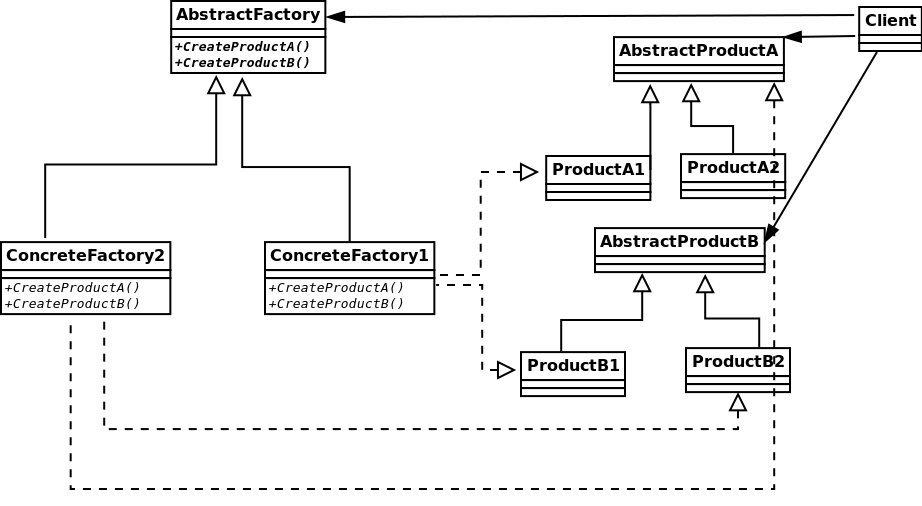

# Clean Code Principles & Some design patterns

## Некоторые принципы написания чистого кода

Очевидно написание чистого кода имеет множество плюсов. Чистый код облегчает его поддержку и расширение программ, снижает количество ошибок, повышает читаемость и тестируемость, экономит время и ресурсы, способствует совместной работе в команде, и в конечном итоге повышает качество программного продукта

### DRY - Don't repeat yourself

Как следует из названия, принцип побуждает не дублировать код, не повторяться, а переиспользовать классы/методы/функции.   
Принцип был введен в книге "The pragmatic Programmer" Andy Hunt в 1999 году  

В книге принцип описывается так:
```
Every piece of knowledge must have a single, unambiguous, authoritative representation within a system
```
piece of knowledge - функциональная/логически-завершенная часть кода или алгоритма

### KISS - keep it short simple / keep it simple, stupid

Разработан в ВМС США в 1960 году. Заключается в избежании усложнения системы, придумывании более сложного решения, чем того требует задача.  
В простоту кода так же входит его читабельность, удобство дальнейшей поддрежки кода.

### YAGNI - You ain't gonna need it

Принцип побуждающий не писать код, который не нужен/не используется.  
При рефакторинге не бояться удалять функции, которые уже не нужны
Кроме того, избегать добавления функциональности для будущего, если она не требуется прямо сейчас. 

Попытка писать код на будущее может привести к ряду негативных последствий:

1. **Потеря времени**: Время, которое можно было бы потратить на добавление, тестирование и улучшение необходимых функций, тратится на ненужный код.
2. **Дополнительное тестирование и документация**: Новые функции требуют ресурсов для тестирования и документирования, что увеличивает общие затраты.
3. **Препятствия для новых требований**: Избыточная функциональность может затруднить добавление действительно необходимых новых функций в будущем.
4. **Несоответствие нуждам**: Код, написанный заранее, может не соответствовать требованиям, когда он действительно понадобится.
5. **Бесполезность**: Лишний код может никогда не пригодиться.
6. **Усложнение программы**: Избыточный код делает программу сложнее и менее понятной, что противоречит принципу KISS.
7. **Эффект снежного кома**: Добавление ненужной функциональности может привести к ещё большему усложнению кода из-за желания добавить дополнительные ненужные функции.


### APO - Avoid Premature Optimization

Принцип гласит - избегайте преждевременной оптимизации. 

Негативные последствия:
1. **Потеря времени**: Оптимизация отнимает время, которое можно было бы использовать для добавления, тестирования и улучшения функциональности, необходимой прямо сейчас.
2. **Усложнение кода**: Ранняя оптимизация часто делает код более сложным и трудным для понимания, что затрудняет его поддержку.
3. **Меньшая гибкость**: Оптимизированный код может быть менее гибким и сложнее адаптируемым к изменяющимся требованиям.
4. **Риски ошибок**: Более сложный и оптимизированный код увеличивает вероятность появления ошибок.
5. **Неэффективность**: Вы можете потратить время на оптимизацию участков кода, которые в итоге окажутся не критичными для производительности.

### BDUF - Big Design Uo Front

Прежде чем приступить к разработке, распланирйте и продумайте архитектуру системы.  
Это принцип ассоциируют с Waterfall методологией (конвейерная разработка по заранее продуманному плану) и противопоставляют Agile методологии, которая адаптируется под изменяемость продукта  

Однако можно трактовать принцип не глобально на всю систему, а к примеру на отдельные ее части. Вместо того, чтобы сразу приступать к написанию кода, убедиться, что все продумано

### Composition over inheritance - композиция предпочтительнее наследования


    Inheritance is often overused, even by experienced developers. A sound rule of software engineering is to minimize coupling: if a relationship can be expressed in more than one way, use the weakest relationship that's practical.
    – Herb Sutter & Andrei Alexandrescu

Наследование - сложная концепция, которая может повлечь множество ошибок. 
Рекомендуется использовать наследование там, где оно очень необходимо. Хороший кейс наследования - от интерфейсного класса. В таком случае родительский класс не требует определенный реализации методов, а лишь указывает на необходимость существования этих методов.

Композиция - переиспользуемую часть кода (класс, от которого мы могли бы отнаследоваться) использовать как поле другого класса (который мог бы быть дочерним)
```cpp
class Transform {
    vec3 position;
    vec3 rotation;
    vec3 scale;
};

class Character {
 public:

 private:
    Transform _transform;
};

class Obstacle {
 public:

 private:
    Transform _transform;
};
```
## Бритва Оккама

«Не следует множить сущее без необходимости» 

Побуждает не создавать новые сущности без необходимости, так же интерпретируется как закон бережливости. Принцип предполагает необходимость отсечь все лишнее


## Принципы SOLID

* **Single Responsibility Principle** (Принцип единственной ответственности):   
    Каждый класс должен иметь только одну причину для изменения   
      
    То есть если сущность делает слишком много, имеет смысл разделить на отдельные методы/классы и тд

* **Open/Closed Principle** (Принцип открытости/закрытости): 
    Классы должны быть открыты для расширения, но закрыты для изменения   
      
    Пример - использование наследования, вместо того чтобы просто добавлять дополнительные методы/функции изменяя логику класса


* **Liskov Substitution Principle** (Принцип подстановки Барбары Лисков): 
    Объекты в программе должны быть заменяемы экземплярами их подтипов без изменения правильности программы
      
    Также проявляется в наследовании

* **Interface Segregation Principle** (Принцип разделения интерфейсов): 
    Клиенты не должны зависеть от интерфейсов, которые они не используют  
      
    Не нужно создавать узкоспециализированные интерфейсы, заточенные под конкретные классы

* **Dependency Inversion Principle** (Принцип инверсии зависимостей): 
    Зависимость должна быть на абстракциях, а не на конкретных реализациях классов  

    Сущности не должны полагаться на конкретную реализацию, верхние модули не должны зависеть от нижних, а все должно зависеть от абстракций, позволяющих менять реализацию


# Rule of 3

В C++ правило "Rule of 3" гласит, что если вы определяете любой из следующих методов в классе, вы должны определить все три:

* Деструктор ```∼X()```
* Конструктор копирования ```X(const X&)```
* Оператор присваивания копированием ```X& operator=(const X&)```

Это связано с тем, что эти методы обычно управляют ресурсами (например, динамической памятью), и если вы явно определяете один из них, вам, вероятно, нужно явное управление ресурсами во всех трех.

Если ресурсы не должны быть или не могут быть скопированы, нужно указать как delete

```cpp
X(const X&) = delete
X& operator=(const X&) = delete
```

# Rule of 5

В C++11 добавилось правило *Rule of 5*, которое расширяет *Rule of 3*, включив в него методы для перемещения:

* Деструктор ```∼X()```
* Конструктор копирования ```X(const X&)```
* Оператор присваивания копированием ```X& operator=(const X&)```
* Конструктор перемещения ```X(X&&)```
* Оператор присваивания перемещением ```X& operator=(X&&)```

# Design patterns

## Singleton 

Шаблон проектирования Singleton гарантирует, что у класса будет только один экземпляр, и предоставляет глобальную точку доступа к этому экземпляру. Экземпляр класса создается через метод, который это гарантирует
Например, класс, реализующий единое подключение к базе данных

Кто-то наоборот считает это антипатерном, советуя наоборот не применять в коде

```cpp
#include <iostream>
#include <mutex>

class Singleton {
public:
    static Singleton& getInstance() {
        static Singleton instance;
        return instance;
    }

    void showMessage() {
        std::cout << "Singleton instance" << std::endl;
    }

private:
    Singleton() {}
    ~Singleton() {}
    Singleton(const Singleton&) = delete;
    Singleton& operator=(const Singleton&) = delete;
};

int main() {
    Singleton& singleton = Singleton::getInstance();
    singleton.showMessage();
}
```

## PIMPLE

Явное отделение интерфейса от реализации логики
 - Вся реализация помещается в отдельный класс Impl
 - Если изменить логику реализации Impl в cpp, класс клиента не нужно перекомпилировать

```cpp
class A {
 public:
    A();
    ∼A();
    void f();
 private:
    class Impl; 
    Impl* ptr; 
};
```

Улучшенный вариант с умным указателем, добавление возможности копирования и перемещения объекта

```cpp
class MyClassImpl;
class MyClass
{
public:
    explicit MyClass();
    ~MyClass(); 
 
    // movable:
    MyClass(MyClass && rhs) noexcept;   
    MyClass& operator=(MyClass && rhs) noexcept;
 
    // and copyable
    MyClass(const MyClass& rhs);
    MyClass& operator=(const MyClass& rhs);
 
    void DoSth();
    void DoConst() const;
 
private:
    const MyClassImpl* Pimpl() const { return m_pImpl.get(); }
    MyClassImpl* Pimpl() { return m_pImpl.get(); }
 
    std::unique_ptr<MyClassImpl> m_pImpl;
};
```

[src](https://evileg.com/ru/post/322/)

## Curiosity Recurring Template Pattern

CRTP – это шаблон проектирования, в котором класс-наследник используется в качестве параметра шаблона для базового класса

Можно интерпретировать как замену наследованию от абстрактного класса с виртулальными методами, не теряя память на виртуальную таблицу, и время на поиск метода в ней

```cpp
#include <iostream>

template <typename Derived>
class Base {
public:
    void interface() {
        static_cast<Derived*>(this)->implementation();
    }
};

class Derived : public Base<Derived> {
public:
    void implementation() {
        std::cout << "Implementation in Derived" << std::endl;
    }
};

int main() {
    Derived d;
    d.interface();
}

```

```cpp
# include <iostream>
template <typename T>
struct Writer {
    void write(const char* str) {
        static_cast<const T*>(this)->write_impl(str);
    }
};

class CerrWriter : public Writer<CerrWriter> {
    void write_impl(const char* str) { std::cerr << str;
};

class CoutWriter : public Writer<CoutWriter> {
    void write_impl(const char* str) { std::cout << str;
};

int main(){
    CoutWriter x;
    CerrWriter y;
    x.write("abc");
    y.write("abc");
}
```

## Abstract Factory
Паттерн абстрактная фабрика -  интерфейс для создания семейств связанных или зависимых объектов без указания их конкретных классов



```cpp
#include <iostream>

// Абстрактный продукт A
class AbstractProductA {
public:
    virtual void operationA() const = 0;
    virtual ~AbstractProductA() {}
};

// Абстрактный продукт B
class AbstractProductB {
public:
    virtual void operationB() const = 0;
    virtual ~AbstractProductB() {}
};

// Конкретный продукт A1
class ConcreteProductA1 : public AbstractProductA {
public:
    void operationA() const override {
        std::cout << "Operation A1" << std::endl;
    }
};

// Конкретный продукт A2
class ConcreteProductA2 : public AbstractProductA {
public:
    void operationA() const override {
        std::cout << "Operation A2" << std::endl;
    }
};

// Конкретный продукт B1
class ConcreteProductB1 : public AbstractProductB {
public:
    void operationB() const override {
        std::cout << "Operation B1" << std::endl;
    }
};

// Конкретный продукт B2
class ConcreteProductB2 : public AbstractProductB {
public:
    void operationB() const override {
        std::cout << "Operation B2" << std::endl;
    }
};

// Абстрактная фабрика
class AbstractFactory {
public:
    virtual AbstractProductA* createProductA() const = 0;
    virtual AbstractProductB* createProductB() const = 0;
    virtual ~AbstractFactory() {}
};

// Конкретная фабрика 1
class ConcreteFactory1 : public AbstractFactory {
public:
    AbstractProductA* createProductA() const override {
        return new ConcreteProductA1();
    }

    AbstractProductB* createProductB() const override {
        return new ConcreteProductB1();
    }
};

// Конкретная фабрика 2
class ConcreteFactory2 : public AbstractFactory {
public:
    AbstractProductA* createProductA() const override {
        return new ConcreteProductA2();
    }

    AbstractProductB* createProductB() const override {
        return new ConcreteProductB2();
    }
};

// Клиентский код
void clientCode(const AbstractFactory& factory) {
    AbstractProductA* productA = factory.createProductA();
    productA->operationA();
    delete productA;

    AbstractProductB* productB = factory.createProductB();
    productB->operationB();
    delete productB;
}

int main() {
    ConcreteFactory1 factory1;
    clientCode(factory1);

    ConcreteFactory2 factory2;
    clientCode(factory2);

    return 0;
}

```

