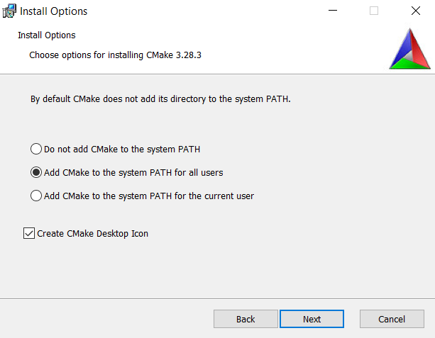
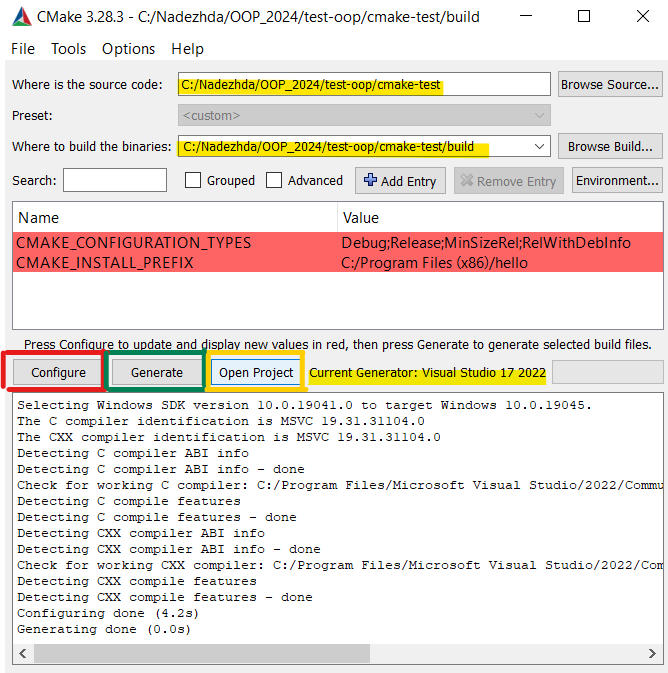
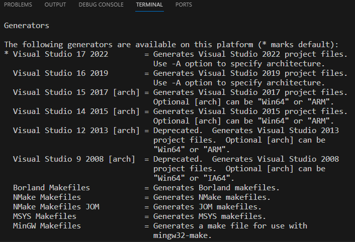
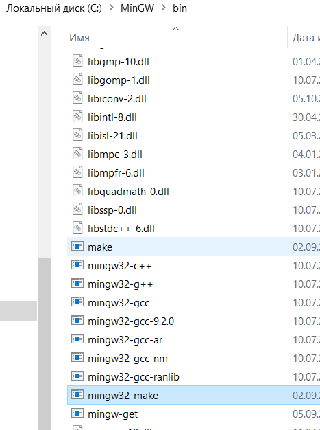
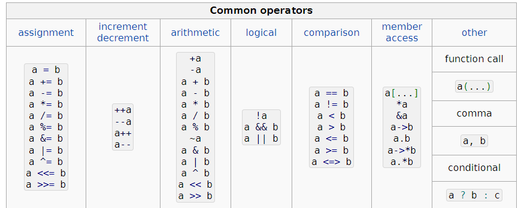

# Семинар 13.02 
## Знакомство с CMake, перегрузка операторов, класс комплексных чисел

## Содержание
* [Немного полезных команд для гита](#git)
* [CMake](#cmake)
* [CMake через терминал](#cmaketerm)
* [Конструктор, деструктор](#oop1)
* [Перегрузка операторов](#oop2)
* [Google Style guide](#oop3)

### <a id="git"></a>Немного полезных команд для гита

```
git status
git branch
git checkout -b <название новой ветки>
git merge <название ветки> -m "Комментарий"
```

* git status - проверка текущего состояния репозитория. На какой вы ветке, какие файлы отслеживаете, нужно ли что-то закоммитить
* git branch - проверка на какой ветке вы сейчас находитесь
* git checkout -b <название новой ветки> - создание новой ветки и сразу же переход на нее
* git merge <название ветки> -m "Комментарий" - объединить ветки (историю коммитов)

Ветки — это когда в некоторой точке история коммитов разделяется. Они помогают разным людям работать параллельно над одним проектом — каждый в своей ветке. А затем эти ветки соединяются воедино — в один проект.

##  <a id="cmake"></a>CMake - кроссплатформенная автоматизированная система сборки проектов

Непосредственно сборкой система не занимается, а только генерирует Makefile, который потом будет выполнен утилитой make. То есть цель CMake - взять описание проекта и сгенерировать файлы конфигурации под вашу систему (с помощью которых уже потом можно будет собрать проект)

Поведение сборки определяется в файлах CMakeLists.txt - по одному в каждом каталоге исходного кода. Файл CMakeLists каждого каталога определяет, что должна делать система сборки в этом конкретном каталоге. Он также определяет, какие подкаталоги должны обрабатывать CMake.

#### Минимальный setup файла CMakeLists.txt
```
cmake_minimum_required(VERSION 3.10)

project(hello)
add_executable(hello main.cpp)
```

[Скачать CMake](https://cmake.org/download/)

  

**! Не забудьте отметить необходимость добавить в PATH, или добавьте сами**

## Использование с Visual Studio 

  

  

Чтобы подготовить проект к сборке необходимо последовательно выполнить действия:
1. Сконфигурировать (Configure)
На этом этапе CMake создает внутреннее представление вашего проекта
2. Сгенерировать (Generate)
Генератор отвечает за написание файлов для вашей системы сборки (на основе созданного в пункте 1. представления), необходимо выбрать один из генераторов, например, Visual Studio 17 2022
3. Открыть проект, по кнопке или из файлов

**!Обратите внимание, вы создали новую директорию /build, эту папку с ее содержимым нужно добавить в .gitignore и не грузить на гит**

## <a id="cmaketerm"></a>Использование с VS Code (через терминал) Windows/Linux

Можно работать с CMake непосредственно через терминал, без приложения. Именно для этого мы при установке добавляли в PATH

```
cmake --version
```
Как обычно наличие исполняемого файла можно проверить, посмотрев его версию

```
mkdir build
cd build
cmake ..
make
```

Порядок генерации файлов для сборки и непосредственно сборка очнь простой.
1. Нужно самостоятельно создать папку build
2. Перейти в нее
3. cmake .. - команда, при которой последовательно выполняется процесс конфигурации и генерации (выше их выполняли по клику на две разные кнопки) точки указывают на путь к директории где лежит главный CMakeLists.txt, в нашем случае на папку выше
4. make - команда, чтобы сбилдить проект 
На самом деле с помощью команды make выполняются инструкции в Makefile, этот файл сгенирировал CMake
* Далее можно запустить созданный main.exe

Важды два момента:
### 1.  Чтобы создался Makefile, а не, например, Solution под Visual Studio, необходимо указать параметр генератору и команду 3. выполнять немного иначе

```
cmake .. -G "MinGW Makefiles"
```

Список доступных генераторов можно посмотреть по команде 
```
cmake --help  
```
  

### 2. Нужно отдельно установить make

На Windows можно сделать так:

1. [Установить MinGW](https://sourceforge.net/projects/mingw/files/Installer/mingw-get-setup.exe/download?use_mirror=deac-riga&download=&failedmirror=kumisystems.dl.sourceforge.net) (если вы еще не скачивали компиляторы, как предлагалось на прошлом занятии)
Не забываем про PATH
2.  Установить 'mingw32-make' командой из терминала
```
mingw-get install mingw32-make
```
3. Для удобства переименовать 'mingw32-make' в 'make' 
**Не удаляйте mingw32-make** просто продублируйте, иначе cmake не найдет его

 

4. Проверить возможность вызвать из терминала make  

Вот теперь можно посльзоваться cmake из терминала, в том числе в VS Code

##  <a id="oop1"></a>ООП - конструкторы и перегрузка операторов

Структура отличается от класса отсутствием инварианта.

### Конструктор

Конструктор в C++ - это специальный метод, который вызывается автоматически во время создания объекта. Обычно он используется для инициализации элементов данных новых объектов. Конструктор в C++ имеет то же имя, что и класс или структура. Он создает значения, т.е. предоставляет данные для объекта, поэтому он известен как конструктор.

Виды конструкторов:
* Конструктор по умолчанию - все параметры инициализируются значениями по умолчаню
```
MyClass object;
```
* Конструктор с параметрами - чтобы инициализировать поля класса
```
MyClass object(3);
```

Модификатор **explicit** запрещает неявное преобразование
```
MyClass object = 3; //не получится неявно преобразовать int в тип MyClass
```

* Конструктор копирования - поля ного объекта инициализируются полями другого объекта 
того класса

```
Rational::Rational(const Rational& other)
    : num(other.num)
    , denum(other.denum)
{}
```

Инициализация полей **в списке инициализации**:
```
Box(int width, int length, int height)
        : m_width(width), m_length(length), m_height(height)
    {}
```

Перед телом функции появились двоеточие и код между ним и фигурными скобками, обозначающими пустые тела функции. Список инициализации определяет исходные значения для одного или нескольких полей создаваемого объекта. 

### Деструктор 
Конструктор + деструктор = функциональное замыкание    
Обычно вызывается компилятором неявно при уничтожении объекта  

```
~MyClass() = default;
```

### <a id="oop2"></a>[Перегрузка операторов](https://en.cppreference.com/w/cpp/language/operators)

Допускается возможность перегрузки операторов (overloading), то есть способность переопределения привычных операторов типа +, *, >, <, =, >>, <<, [], () и т.д. для своих пользовательских типов. Заранее без перегрузки компилятор никак не узнает что 'означает', к примеру, плюс для вашего типа.

Оператор - это такой же метод класса, просто имя немного необычное, например, operator+

```
 MyClass a;
 MyClass b;
 a = a + b;
 a.operator+(b);
```

 

#### Некоторые операторы можно перегружать как метод класса, так и как функцию

* Как метод класса
```cpp
class MyClass{
    MyClass operator+(MyClass& other){
        // реализация
        return //объект типа MyClass
    }
};
```

* Как функция вне класса
```cpp
class MyClass {
    //реализация класса
};

MyClass operator+(MyClass& lhs, MyClass& rhs) {
    return //объект типа MyClass
}
```

* Через дружественные функции (!не рекомендуется)

Ключевое слово friend используется, чтобы определить функции, дружественные для данного класса. На практике это означает, что дружественная функция имеет доступ к приватным членам класса.

```cpp
class MyClass {
public:
    friend MyClass operator+(MyClass& lhs, MyClass& rhs);
};

MyClass operator+(MyClass& lhs, MyClass& rhs) {
    return //объект типа MyClass
}
```
Почему возникла необходимость использования friend?

Перегрузка операторов через методы класса не используются, если первый операнд не является классом (например int), или это класс, который нельзя изменять (например std::ostream). Соответственно не получится через методы класса переопределить оператор <<, так как первый его операнд - специальный класс std::ostream.

```cpp
std::ostream& operator<<(std::ostream& out, const Y& y)
{
    return out << y.data; // можно получить доступ к приватному полю Y::data
}
```
**НО** использование friend рекомендуется только в крайнем случае, поэтому где можно обойтись без friend - следует это сделать. 
Здесь это можно сделать через метод класса

```cpp
class MyClass {
public:
    std::ostream& writeTo(std::ostream& ostrm) const;
};


std::ostream& operator<<(std::ostream& ostrm, const MyClass& rhs) {
    return rhs.writeTo(ostrm);
}

```

### Атрибут [[nodiscard]]  
Nodiscard используется, чтобы предотвратить игнорирование возвращаемого значения функции, не имеющей побочных эффектов.  
[Примеры использования атрибутов](https://hackingcpp.com/cpp/lang/attributes.html)

## <a id="oop3"></a>[Google style guide](https://google.github.io/styleguide/cppguide.html)

Например, рекомендации по пробелам горизонтальным
```cpp
int i = 0;  // Two spaces before end-of-line comments.

void f(bool b) {  // Open braces should always have a space before them.
  ...
int i = 0;  // Semicolons usually have no space before them.
// Spaces inside braces for braced-init-list are optional.  If you use them,
// put them on both sides!
int x[] = { 0 };
int x[] = {0};

// Spaces around the colon in inheritance and initializer lists.
class Foo : public Bar {
 public:
  // For inline function implementations, put spaces between the braces
  // and the implementation itself.
  Foo(int b) : Bar(), baz_(b) {}  // No spaces inside empty braces.
  void Reset() { baz_ = 0; }  // Spaces separating braces from implementation.
  ...
```


