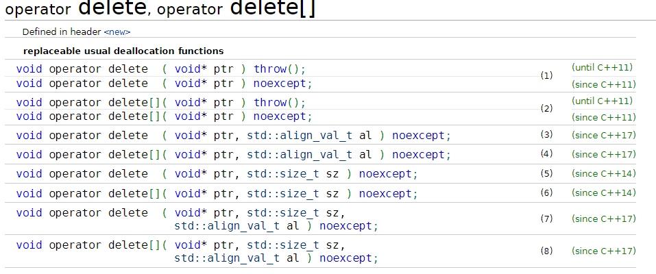

# Работа с памятью, умные указатели

## Вспомним особенности new delete

**Оператор new** - выполняет выделение (allocation) динамической памяти
* Возвращает указатель на выделенную память
* Выделение памяти происходит с автоматическим вызовом конструктора
* Значение указателя - адрес первого байта выделенной памяти
* Указатель указывает на объект определенного типа
* Указатель **не знает** на какое количество элементов он указывает

Операторы new, delete так же возможно перегрузить
```cpp
void* operator new(size_t size) {
    std::cout << "New, allocated " << size << std::endl;
    return malloc(size);
}

void operator delete(void* ptr, size_t size) {
    std::cout << "Delete, deallocated " << size << std::endl;
    return free(ptr);
}

void* operator new[](size_t size) {
    std::cout << "New[], allocated " << size << std::endl;
    return malloc(size);
}

void operator delete[](void* ptr) noexcept {
    std::cout << "Delete[], deallocated " << std::endl;
    return free(ptr);
}
```



[Оператор new cpp reference](https://en.cppreference.com/w/cpp/memory/new/operator_new)
[Оператор delete cpp reference](https://en.cppreference.com/w/cpp/memory/new/operator_delete)

## Умные указатели

Начиная со стандарта C++11 появились smart pointers, определенные в заголовке *memory*:

* std::unique_ptr — умный указатель, владеющий динамически выделенным ресурсом;
* std::shared_ptr — умный указатель, владеющий разделяемым динамически выделенным ресурсом. Несколько std::shared_ptr могут владеть одним и тем же ресурсом, и внутренний счетчик ведет их учет;
* std::weak_ptr — подобен std::shared_ptr, но не увеличивает счетчик.

Умный указатель **автоматически** удаляет объект, на который он ссылается

### Рассмотрим unique_ptr

Указатель unique_ptr как бы 'владеет' (ownership) объектом, на который он указывает.

std::unique_ptr - это умный указатель, который обеспечивает эксклюзивное владение динамически выделенным ресурсом. Уникальный указатель гарантирует, что только один std::unique_ptr владеет ресурсом.   

Когда std::unique_ptr уничтожается, он автоматически освобождает выделенную память. Это позволяет избежать утечек памяти и упрощает управление ресурсами.  

* Создание указателя

```cpp
#include <memory>

// Создание std::unique_ptr для int
std::unique_ptr<int> ptr(new int(42));

// Создание std::unique_ptr для массива int
std::unique_ptr<int[]> arrPtr(new int[5]);

auto ptr = std::make_unique<int>(42);
auto arrPtr = std::make_unique<int[]>(5);

```

* Передача между функциями/методами

std::unique_ptr может передаваться между функциями или методами, как и обычные указатели
**НО** только один std::unique_ptr может владеть ресурсом. Попытка копирования приведет к ошибке компиляции. Поэтому используем std::move

```cpp
void process(std::unique_ptr<int> ptr) {
    // smth
}

int main() {
    std::unique_ptr<int> ptr(new int(42));
    process(std::move(ptr)); // Передача владения указателем

    return 0;
}

```

* Передача в функцию/метод, когда требуется обычный указатель, ссылка:

```cpp
#include <iostream>
#include <memory>


void processPtr(const int* ptr) {
    std::cout << "Value at pointer: " << *ptr << std::endl;
}


void processRef(const int& ref) {
    std::cout << "Value by reference: " << ref << std::endl;
}

int main() {
    auto ptr = std::make_unique<int>(42);

    processPtr(ptr.get());

    processRef(*ptr);
    return 0;
}

```

В функцию processPtr передается обычный указатель const int*, полученный с помощью метода get(), который возвращает указатель на управляемый объект. Внутри функции мы можем использовать этот указатель как обычный указатель на const int.

В функцию processRef передается ссылка const int&, полученная путем разыменования умного указателя *ptr. Функция processRef принимает ссылку на значение, хранящееся внутри умного указателя.

* Пример использования с вектором

```cpp
#include <iostream>
#include <vector>
#include <memory>

int main() {
    std::vector<std::unique_ptr<int>> vec;

    for (int i = 0; i < 5; ++i) {
        vec.push_back(std::make_unique<int>(i));
    }

    for (const auto& ptr : vec) {
        std::cout << *ptr << std::endl; 
    }

    return 0;
}

```