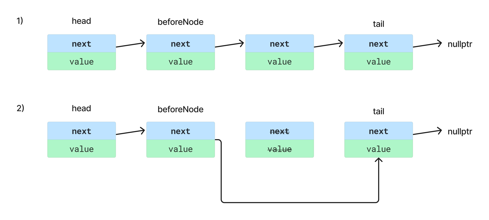

# Односвязный список, реализация стека на нодах

**Односвязный список** - это структура данных, состоящая из узлов, каждый из которых содержит какое-то значение и ссылку (или указатель) на следующий узел в списке.

Доступ к элементам списка может осуществляться только последовательно, начиная с его начала (головы). А вставка и удаление элементов в список происходит быстро, так как нужно создать ноду и просто перевести на нее указатели.


Данные в связном списке хранятся не последовательно в куче, а вразброс. Таким образом, структура решает проблему производительности, если нам приходится часто добавлять и удалять данные.


## Операции с односвязным списком

### Добавление нового элемента в конец списка O(1)

1. Создать новый объект элемента списка - newNode (value=value, next=nullptr)
2. Обновить ссылку next последнего элемента списка (который указывает на nullptr) так, чтобы она указывала на новый элемент newNode.
3. Обновить переменную tail, чтобы она указывала на новый последний элемент списка newNode.


### Добавление нового элемента в начало списка O(1)

1. Создать новый объект элемента списка - newNode (value=value, next=nullptr)
2. Установить значение ссылки next нового элемента так, чтобы оно указывало на текущий первый элемент списка (head).
3. Обновить переменную head, чтобы она указывала на новый элемент списка newNode.


### Доступ к произвольному элементу списка

Так как ноды в куче хранятся не последовательно, мы не можем просто по индексу обратиться к произвольному элементу. Нужно последовательно перебирать все ноды, пока не дойдем до нужного элемента. Последовательный перебор осуществляется посредством выбора следующей ноды, на которую указывает указатель next текущей ноды.


### Вставка элемента в произвольное место в списке

1. Создать новый объект элемента списка - newNode (value=value, next=nullptr)
2. Последовательно перебрать все ноды, чтобы добраться до ноды (назовем ее beforeNode), после которой нужно вставить элемент. И ноды (назовем ее afterNode), которая будет идти после новой ноды
3. Обновить указатели: beforeNode должна ссылаться на новую ноду, а новая нода на afterNode


### Удаление элементов

a) Для удаления первого элемента достаточно перевести head на следующий элемент
b) Для удаления произвольного элемента треубуется так же перевести указатель beforeNode на ноду, идущую после следующей. Однако сначала потребуется последовательно перебрать ноды, чтобы найти beforeNode




# Стек на нодах (домашнее задание)

```cpp
template <typename T>
class StackLstT {
public:
    StackLstT();
    ~StackLstT();
    StackLstT(const StackLstT<T>& other);
    StackLstT(StackLstT<T>&& other);
    StackLstT(const std::initializer_list<T>& list);
  
  	void push(const T& value);
	void pop();
	T& top() const;
	void swap(StackLstT<T>& other);
	void merge(StackLstT<T>& other);
  
	bool empty() const;
	std::ptrdiff_t size() const;

	bool operator==(const StackLstT<T>& rhs) const;
	bool operator!=(const StackLstT<T>& rhs) const;

	StackLstT<T>& operator=(const StackLstT<T>& rhs) noexcept;
	StackLstT<T>& operator=(StackLstT<T>&& other);

private:
    struct Node {
        T value;
        Node* next = nullptr;
    };

    Node* head_ = nullptr;  
};

#endif
```